# AI-900: Reconhecimento Facial e Transformação de Imagens em Dados no Azure ML

-green)

-blue)

 

## Índice

- [Descrição do Projeto](#Descrição-do-Projeto)
- [Acessos necessários](#Acessos-necessários)
- [Aprovisionamento dos recursos do Azure AI Service](#Aprovisionamento-dos-recursos-do-Azure-AI-Service)
- [Conexão do Azure Vision Studio ao Azure AI Service](#Conexão-do-Azure-Vision-Studio-ao-Azure-AI-Service)
- [LAB 1 - Introdução](#LAB-1---Introdução)
- [LAB 1 - Deteção de Rostos no Azure Vision Studio](#LAB-1---Deteção-de-Rostos-no-Azure-Vision-Studio)
- [LAB 1 - Conclusão](#LAB-1---Conclusão)
- [LAB 2 - Introdução](#LAB-2---Introdução)
- [LAB 2 - OCR no Azure Vision Studio](#LAB-2---OCR-no-Azure-Vision-Studio)
- [LAB 2 - Conclusão](#LAB-2---Conclusão)
- [LAB 3 - Introdução](#LAB3---Introdução)
- [LAB 3 - Análise de Imagens no Azure Vision Studio](#LAB-3---Análise-de-Imagens-no-Azure-Vision-Studio)
- [LAB 3 - Conclusão](#LAB-3---Conclusão)
- [Certificados / Certificações Associados ao Projeto](#Certificados-/-Certificações-Associados-ao-Projeto)

 

## Descrição do Projeto

Este projeto é um dos laboratórios do Bootcamp [Microsoft Azure AI Fundamentals](https://web.dio.me/track/microsoft-azure-ai-fundamentals), promovido através da parceria entre a Microsoft e a Dio.me.

Os alunos deste bootcamp tem, como principal objetivo, se prepararem para o exame de certificação Microsoft AI-900, dominando conceitos como visão computacional, classificação inteligente de imagem e inteligência de documentos com IA, enquanto se familiarizam com as tecnologias da Microsoft Azure.

Este desafio é o de número 3 do bootcamp e consiste na execução prática de 3 exercícios, relacionados aos seguintes temas:

- [LAB 1: Deteção de Rostos no Azure Vision Studio](http://aka.ms/ai900-face): XXXXXXX
- [LAB 2: OCR no Azure Vision Studio](http://aka.ms/ai900-ocr): XXXXXXXX
- [LAB 3: Análise de Imagens no Azure Vision Studio](http://aka.ms/ai900-image-analysis): XXXXXXXX

 

## Acessos necessários

Para realizar estes laboratórios, eu precisei criar uma [Subscrição do Microsoft Azure](https://azure.microsoft.com/)

A Microsoft permite criar uma subscrição de teste, na qual vários serviços podem ser experimentados gratuitamente por 12 meses, além de receber $200 para serem utilizados nos primeiros 30 dias.

 

## Aprovisionamento dos recursos do Azure AI Service

Para executar este 3 laboratórios, primeiramente, precisei aprovisionar o serviço Azure IA Service, através os seguintes passos:

1) Acessei o [Azure Portal](https://portal.azure.com/) e efetuei o login com a minha conta Microsoft
2) Efetuei as configurações conforme apresentadas abaixo:
   
   > 

3) O serviço foi aprovisionado quando recebi a mensagem **Your deployment is complete**

   > 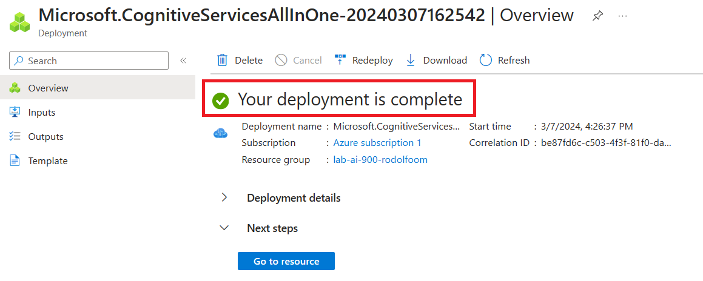

 

## Conexão do Azure Vision Studio ao Azure AI Service

Os 3 laboratórios tiveram, como base, o **Azure AI Vision Studio**. Trata-se de uma plataforma baseada em interface do usuário que permite explorar os recursos do Azure AI Vision sem precisar escrever nenhum código.

Os passos que tivq que seguir para utilizar esta ferramenta foram os seguintes:

1) Acessei o [Azure AI Vision Studio](https://portal.vision.cognitive.azure.com/ e efetuei o login com a minha conta Microsoft
2) Cliquei em View all resources para abrir a janela de seleção do recurso ativo do Azure AI Service:
   
   > 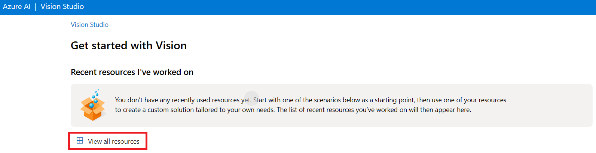

3) Para associar o recurso, obedecendo a seguinte ordem:
   - a) Selecionei o nome do recurso
   - b) Cliquei em **Select as default resource**
   - c) Fechei a janela, clicando em <kbd> X </kbd>
   
    

   > 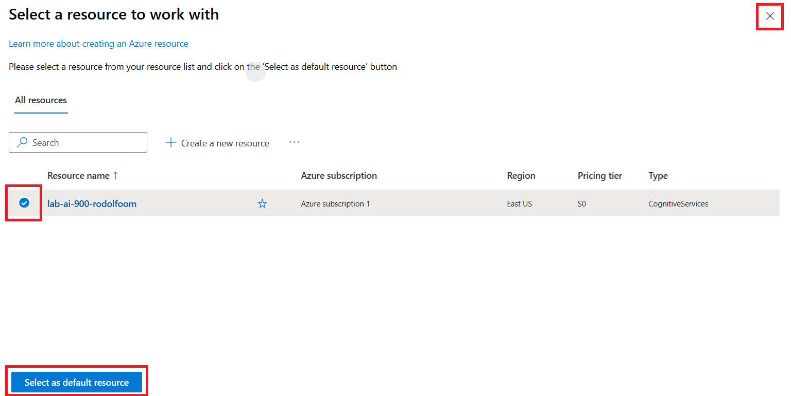

 

## LAB 1 - Introdução

A detecção de rostos é uma das capacidades mais fascinantes do Azure Vision Studio.

Este serviço utiliza algoritmos de aprendizado de máquina para identificar e localizar rostos humanos em uma imagem.

É uma ferramenta poderosa com aplicações variadas, desde segurança até mídias sociais.

 

## LAB 1 - Deteção de Rostos no Azure Vision Studio

1) Uma vez dentro do **Vision Studio**, acessei o *serviço* ***Detect faces in a image***, que fica dentro do grupo ***Face***:

   > 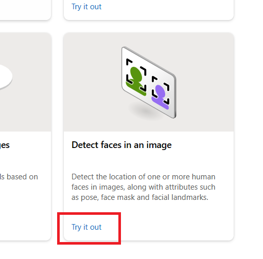

2) Todos os serviços utilizados no Vision Studion consomente o recurso Azure AI Services e tive que dar o consentimento para continuar:

   > 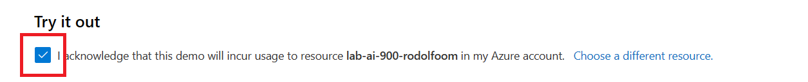

3) Este serviço já vem com algumas amostras de imagens. Porém, submeti uma nova foto:

   Nesta imagem, foram detectados 2 atributos de rostos. Para cada rosto identificado, é gerada uma marcação na imagem. Ao passar o mouse sobre cada marcação, ela fica amarela e sinaliza os atributos referentes no quadro ao lado, chamado de ***Detected attributes***:

   > 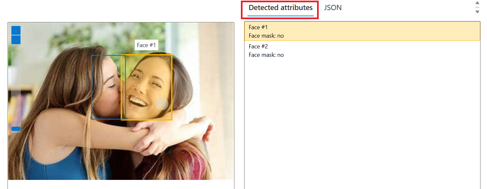

4) É possível visualizar o detalhe dos atributos detectados, clicando-se ***Json***:

   Percebi que, para identificar um rosto, o modelo procurou por atributos associados, como olhos, sobrancelhas, boca, etc. Para cada subatributo, digamos assim, são marcadas as posições (X, Y) na foto, gerando pequenos pontos brancos, que facilitam a identificação

   > 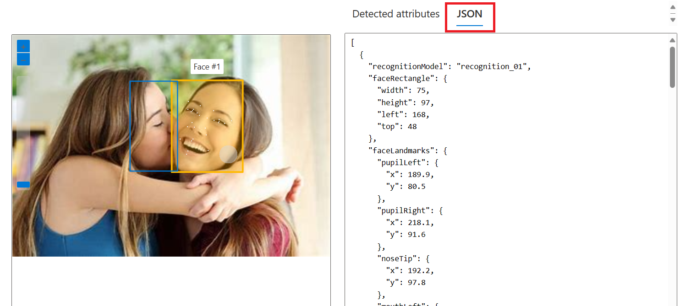

5) Fiz um novo teste, agora submentendo uma foto na qual o rosto está escondido:

   Como esperado, o modelo não conseguiu detectar o rosto pois não foi possível identificar os subatributos, como olhos e nariz, por exemplo:

   > 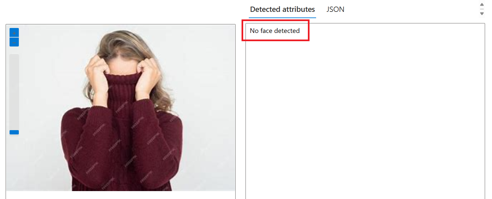

 

## LAB 1 - Conclusão

Em resumo, a detecção de faces no Azure Vision Studio é uma ferramenta poderosa que pode ser utilizada em uma variedade de aplicações, desde o reconhecimento facial até a análise de sentimentos.

 

---

## LAB 2 - Introdução

A extração de texto de imagens, também conhecida como OCR (Reconhecimento Óptico de Caracteres), é outro serviço notável do Azure Vision Studio.

Ele permite que os usuários convertam texto não estruturado em imagens em texto estruturado que pode ser editado, pesquisado e armazenado de maneira mais eficiente.

 

## LAB 2 - OCR no Azure Vision Studio

1) Dentro **Visual Studio**, escolhi o serviço ***Extract text from images***, disponível no grupo ***Optical character recognition***:

   > 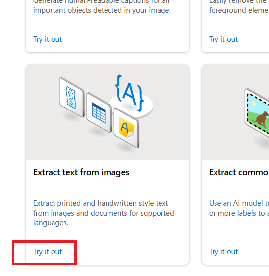

2) Para testar este serviço, submeti uma imagem de propaganda contendo vários textos com fontes, cores, tamanhos e formatos diferente:

   Como retorno, todas as palavras existentes na imagem foram encontradas e mapeadas uma a uma, gerando uma marcação em cada uma dela

   > 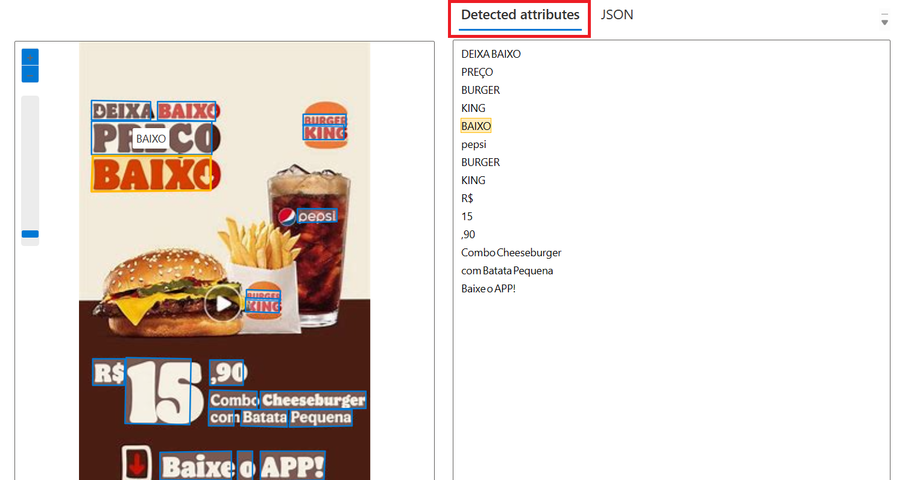

3) Analisando o ***Json***, é possível ver que, para cada palavra, existem atributos de posição (X, Y), bem como o nível de confiança da identificação. Neste exemplo, para a palavra **DEIXA**, a identificação tem um nível de confiança de **98,3%**:

   > 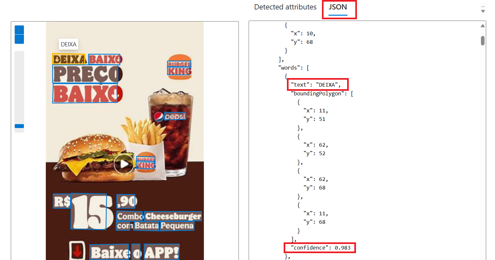

4) Realizei um novo teste, agora submentendo um cupom fiscal scaneado. Incrivelmente o modelo conseguiu identificar **TODOS** os textos do cupom, mesmo estando a imagem torta e com pequenas distorções:

   > 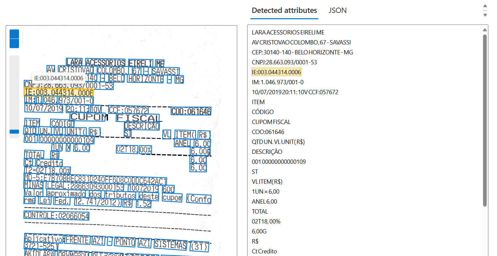   

 

## LAB 2 - Conclusão

A capacidade do Azure Vision Studio de extrair texto de imagens é uma ferramenta valiosa para a transformação digital, permitindo que as empresas automatizem processos, melhorem a eficiência e extraiam valor de dados não estruturados.

 

---

## LAB 3 - Introdução

Adicionar legendas a imagens e extrair marcas comuns são duas funcionalidades que demonstram a versatilidade do Azure Vision Studio.

O serviço de legendas gera descrições precisas e significativas de imagens, enquanto a extração de marcas identifica logotipos, produtos e outros elementos notáveis.

 

## LAB 3 - Análise de Imagens no Azure Vision Studio

1) O primeiro serviço de análise que testei foi o que adiciona descrição de conteúdo a uma imagem submetida. Para isso, acessei, dentro do grupo ***Image Analysis***, a opção ***Add captions to imagens***:

   > 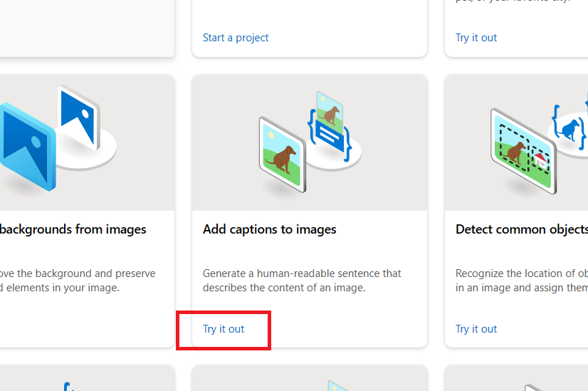

2) O modelo foi capaz de identificar, na imagem, um grupo de pessoas utilizando roupas coloridas. Este serviço é capaz de adicionar uma única frase à imagem:
   
   > 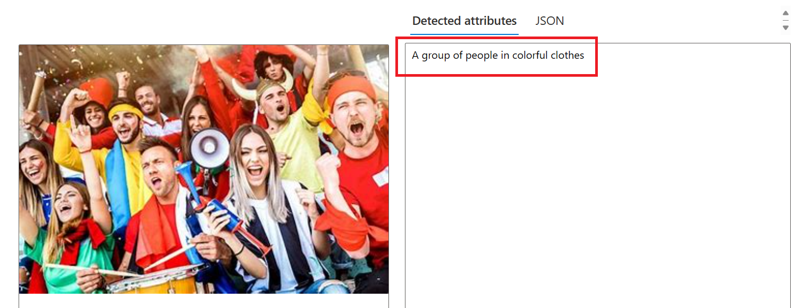

3) Existe um outro serviço chamado ***Add dense captions to imagens***, também dentro de ***Image Analysis***, que permite gerar múltiplas legendas para a imagem:

   > 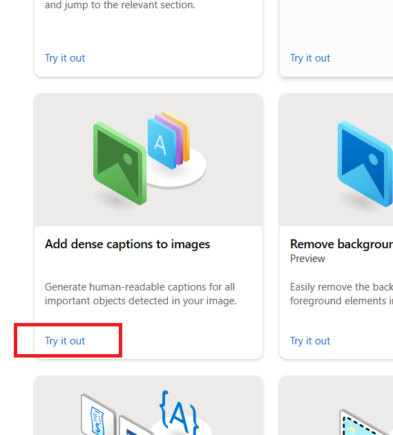

4) Submentendo a mesma imagem anterior a este serviço, o modelo identificou várias legendas possíveis, realizando uma marcação para cada uma delas:
   
   > 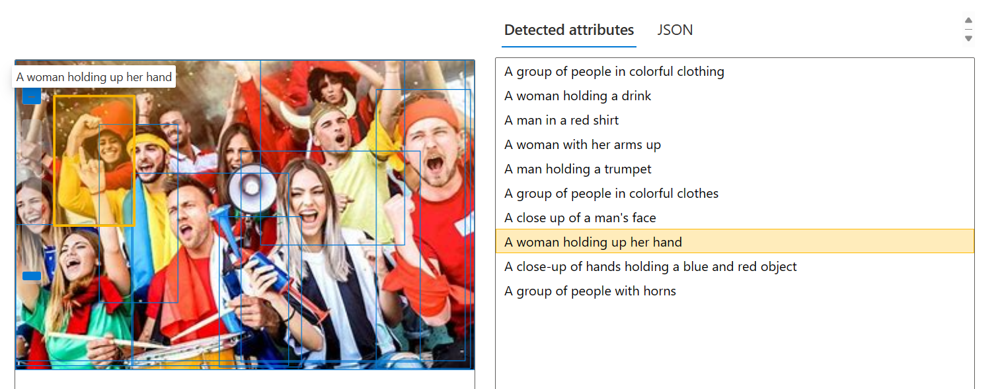

5) 

 

## LAB 3 - Conclusão

A capacidade do Azure Vision Studio de adicionar legendas e extrair marcas de imagens abre novas possibilidades para a análise de conteúdo visual.

Estes serviços podem ser utilizados para melhorar a acessibilidade, realizar análises de marca e muito mais.

 

---

## Certificados / Certificações Associados ao Projeto

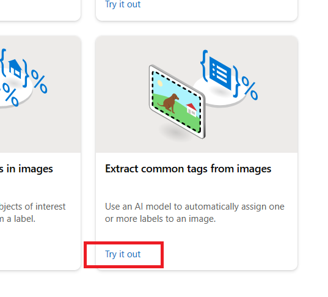
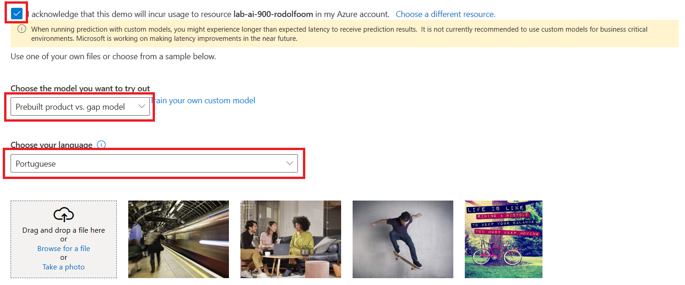
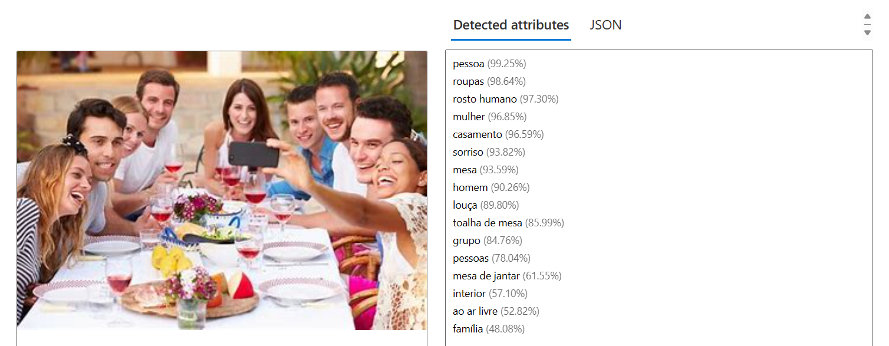
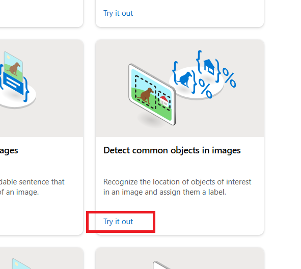
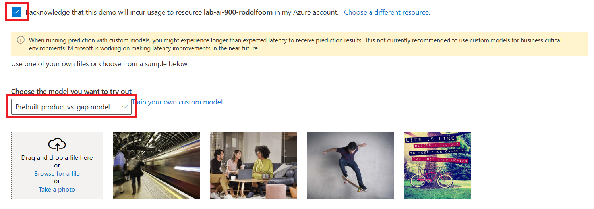
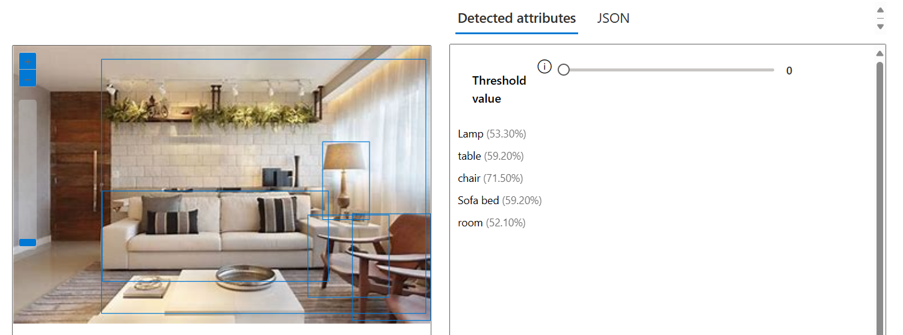
